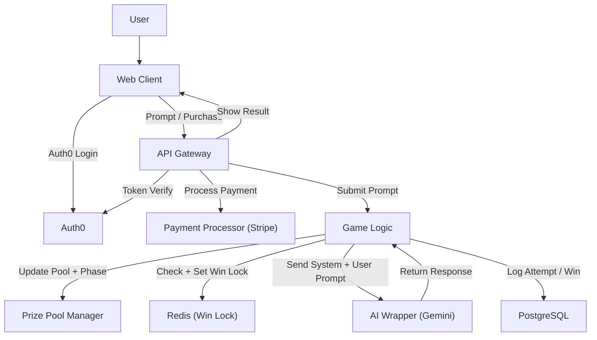

```mermaid
graph TD
    User[User] --> Client["Web Client"]
    Client -- "Auth0 Login" --> Auth["Auth0"]
    Client -- "Prompt / Purchase" --> API["API Gateway"]
    API -- "Token Verify" --> Auth
    API -- "Process Payment" --> Stripe["Payment Processor (Stripe)"]
    API -- "Submit Prompt" --> GameLogic["Game Logic"]
    GameLogic -- "Update Pool + Phase" --> Pool["Prize Pool Manager"]
    GameLogic -- "Check + Set Win Lock" --> Redis["Redis (Win Lock)"]
    GameLogic -- "Send System + User Prompt" --> AI["AI Wrapper (Gemini)"]
    AI -- "Return Response" --> GameLogic
    GameLogic -- "Log Attempt / Win" --> DB["PostgreSQL"]
    API -- "Show Result" --> Client
```
